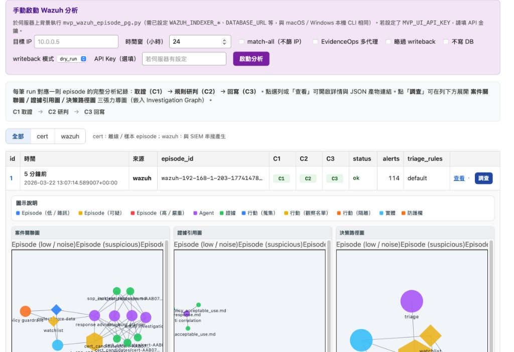

<p align="center">
  
</p>

# Core Agentic RAG for CERT Anomaly Analysis

## 專案概述

這是一個專注於核心 Agentic RAG 功能的專案，用於 CERT 內部威脅數據的異常分析。系統整合了多種異常檢測技術；**Layer C 管線**提供 Episode 驅動的檢索、分析、Writeback 與評估，並可選 GPT-4o 或本地 LLM（見下方「此次更新」與架構文件）。

**架構詳情**：請見 [docs/ARCHITECTURE.md](docs/ARCHITECTURE.md)（合約、資料流、模組職責、CLI、目錄與產物路徑）。

### MVP Web UI 預覽

**手動啟動 Wazuh 分析**、**Runs** 列表，以及列上的 **調查**（展開案件關聯圖、證據引用圖、決策路徑圖）：



## 此次更新摘要

- **CERT v1 路徑與 Layer C**：見 [docs/CERT_V1.md](docs/CERT_V1.md)；`scripts/mvp_cert_layer_c.py` 對 demo／CERT Episode 跑完整 Layer C 並寫入 `analysis_runs`。
- **泛用執行紀錄**：`deployments/sql/analysis_runs_schema.sql`（`source`=`cert`|`wazuh`）；`scripts/mvp_wazuh_episode_pg.py` 改寫入 `analysis_runs`。
- **MVP Web UI**：`services/mvp_ui_api/app.py`（FastAPI）列表／詳情與觸發 CERT 執行；說明見 [docs/MVP_UI.md](docs/MVP_UI.md)。
- **Wazuh 輪詢**：`scripts/wazuh_ingest_poll.py` + `wazuh_ingest_state` 游標；Indexer 查詢共用於 `src/integrations/wazuh_indexer_client.py`。
- **CERT → Episode**：`src/pipeline/cert_to_episodes.py` 從 logon/device CSV（或 synthetic）依 user + 固定時間視窗產出 Episode JSON；CLI `cert2episodes` 可批次寫入 `outputs/episodes/cert/`。
- **知識庫（KB）**：新增 `kb/sop_insider_anomaly.md`、`kb/hunt_query_templates.md`、`kb/response_policy_guardrails.md`，供 retrieve 檢索並供 triage/hunt/response 引用。
- **高風險 Demo**：`scripts/gen_insider_highrisk_episode.py` 產出單一高風險 Episode；`scripts/run_highrisk_demo.sh` 一鍵執行 retrieve → analyze → writeback → eval → demo_report。
- **Docker**：提供 `Dockerfile`、`docker-compose.yml`、`.dockerignore`，可於容器內執行 CLI，產物經 volume 寫回本機。
- **本機部署（Postgres + MVP UI）**：`docker compose -f docker-compose.local.yml up -d --build`，見 [docs/MVP_UI.md](docs/MVP_UI.md)。

## 核心功能

### 🔍 多模態異常檢測
- **Markov Chain 檢測器**: 分析用戶行為序列的模式轉換
- **BERT 異常檢測器**: 基於文本序列的深度學習異常檢測
- **向量存儲**: 用於相似行為搜索的語義檢索

### 🤖 GPT-4o 智能分析
- **用戶行為分析**: 結合異常分數和行為特徵的綜合評估
- **模式識別**: 識別潛在的內部威脅模式
- **風險評估**: 提供詳細的風險等級和建議

### 📊 數據處理
- **CERT 數據集**: 處理真實的內部威脅數據
- **特徵工程**: 自動提取時間序列特徵
- **文本化處理**: 將事件轉換為可分析的文本序列

## 快速開始

### 1. 環境設置

```bash
# 安裝依賴
pip install -r requirements.txt

# 複製 env.example 為 .env 並填入變數（勿提交 .env）
# 例如：OPENAI_API_KEY=<your-key> 等，見 env.example
```

### 2. 運行核心分析

```bash
# 運行核心 Agentic RAG 系統
python scripts/main_agentic_rag_cert.py
```

### 3. Docker Compose（可選）

專案提供 `Dockerfile` 與 `docker-compose.yml`，可在容器內執行 CLI。

```bash
# 複製 env 並填寫（容器會讀取 .env）
cp env.example .env

# 建置並執行預設指令（validate）
docker compose run --rm app

# 範例：retrieve、high-risk demo
docker compose run --rm app python -m src.cli retrieve --episode tests/demo/episode_insider_highrisk.json
docker compose run --rm app bash scripts/run_highrisk_demo.sh
```

`outputs/`、`kb/`、`data/` 以 volume 掛載，結果會寫回本機。

## 專案結構

```
AgenticRAG4TimeSeries/
├── kb/                            # 知識庫（Layer C 檢索用）
│   ├── sop_insider_anomaly.md     # 異常 logon / lateral / triage
│   ├── hunt_query_templates.md    # 多主機 logon、burst、device churn、pivot
│   ├── response_policy_guardrails.md
│   ├── sop_incident_response.md
│   └── policy_acceptable_use.md
├── scripts/
│   ├── main_agentic_rag_cert.py   # 核心 Agentic RAG 系統（LLM）
│   ├── main.py
│   ├── gen_insider_highrisk_episode.py  # 高風險 Episode 產生器
│   └── run_highrisk_demo.sh       # 一鍵 Layer C demo
├── src/
│   ├── contracts/                 # Episode, Evidence, AgentOutput, Hypothesis
│   ├── pipeline/                  # retrieve_evidence, cert_to_episodes, run_agents, writeback_pipeline, demo_report
│   ├── retrievers/                # kb, opencti, query_builder, assemble
│   ├── agents/                    # triage, hunt_planner, response_advisor（Layer C 規則型）
│   ├── eval/                      # run_eval, metrics
│   ├── core/                      # data_processor, vector_store, 異常檢測器
│   └── config.py
├── outputs/                       # evidence/, agents/, writeback/, eval/, demo/, audit/
├── data/                          # CERT 資料（logon.csv, device.csv）
├── tests/demo/                    # 高風險 demo Episode JSON
├── docs/
│   └── ARCHITECTURE.md            # Layer C 架構詳解
├── Dockerfile
└── docker-compose.yml
```

## 核心功能詳解

### 異常檢測流程

1. **數據預處理**
   - 加載 CERT 內部威脅數據集
   - 工程化時間序列特徵
   - 文本化事件序列

2. **模型訓練/加載**
   - 檢查現有訓練好的模型
   - 如果沒有或過期，重新訓練
   - 保存訓練好的模型

3. **異常分析**
   - Markov Chain 分析用戶行為模式
   - BERT 分析文本序列異常
   - 結合分數進行綜合評估

4. **智能分析**
   - GPT-4o 分析異常分數和行為特徵
   - 生成風險評估和建議
   - 提供詳細的安全分析報告

## 技術特點

### 🔧 模型持久化
- 自動檢查和加載現有模型
- 智能決定是否需要重新訓練
- 支持模型版本管理

### 🚀 性能優化
- 向量化數據處理
- 並行異常檢測
- 高效的語義搜索

### 🛡️ 安全分析
- 多維度異常檢測
- 智能風險評估
- 可解釋的分析結果

## 配置選項

### 模型配置
```python
# 在腳本中修改
use_existing, model_status = should_use_existing_models(
    force_retrain=False,        # 是否強制重新訓練
    max_model_age_days=30       # 模型最大年齡（天）
)
```

### LLM 配置
```python
llm = ChatOpenAI(
    model="gpt-4o",
    temperature=0.1,            # 創造性 vs 一致性
    max_tokens=1000            # 最大輸出長度
)
```

## 故障排除

### 常見問題

1. **模型加載失敗**
   - 檢查 `models/` 目錄是否存在
   - 確認模型文件完整性
   - 重新訓練模型

2. **API Key 錯誤**
   - 確認 OpenAI API Key 設置正確
   - 檢查網絡連接
   - 驗證 API 配額

3. **數據處理錯誤**
   - 確認 CERT 數據集路徑正確
   - 檢查數據格式
   - 驗證特徵工程步驟

## 開發指南

### 添加新的異常檢測器

1. 創建新的檢測器類
2. 實現 `fit()` 和 `detect_anomaly()` 方法
3. 在 `initialize_agentic_rag_system()` 中集成

### 擴展分析功能

1. 修改 `analyze_user_anomalies()` 函數
2. 添加新的分析維度
3. 更新報告生成邏輯

## 貢獻指南

歡迎提交 Issue 和 Pull Request 來改進這個專案！

## High-Risk Insider Demo

一鍵 Layer C demo：產生高風險內部人 Episode（lateral + burst + device churn），依序執行 retrieve → analyze → writeback → eval → demo_report。

```bash
bash scripts/run_highrisk_demo.sh
```

產物路徑：`outputs/evidence/`、`outputs/agents/`、`outputs/writeback/`、`outputs/eval/metrics.csv`、`outputs/demo/demo_report.md`。Episode ID：`cert-USER0420-highrisk`。管線與模組說明見 [docs/ARCHITECTURE.md](docs/ARCHITECTURE.md)。

## 使用 CERT r3.2 進行 Layer C 測試

若已下載 [CERT Insider Threat r3.2](https://www.kaggle.com/datasets/nitishabharathi/cert-insider-threat)（含 `logon.csv`、`device.csv`），可直接用該資料產出 Episode 並跑完整 Layer C 管線（retrieve → analyze → writeback → eval）。

**一鍵腳本**（預設 r3.2 路徑為 `~/Downloads/r3.2`，只跑前 5 個 episode）：

```bash
R32_DATA_DIR=/path/to/r3.2 bash scripts/run_layer_c_r32.sh
# 或指定筆數：LIMIT=10 bash scripts/run_layer_c_r32.sh
```

**手動兩步驟**：

```bash
# 1) 從 r3.2 產出 Episode JSON 到 outputs/episodes/cert_r32
python3 -m src.cli cert2episodes --data_dir /path/to/r3.2 --out_dir outputs/episodes/cert_r32 --window_days 7 --run_id cert-r32-1

# 2) 對該目錄跑 Layer C 評估（預設最多 20 個 episode）
python3 -m src.cli eval --episodes_dir outputs/episodes/cert_r32 --limit 5
```

產物：`outputs/evidence/`、`outputs/agents/`、`outputs/writeback/`、`outputs/eval/metrics.csv`。單元測試（使用 r3.2 形狀的 fixture，無需真實 r3.2 檔）：`pytest tests/test_layer_c_cert.py -v`。

## 授權

本專案採用 MIT 授權條款。 