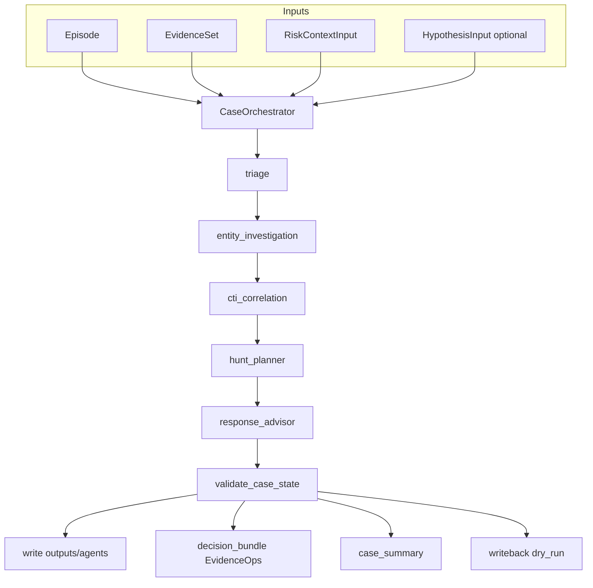

# SenseL EvidenceOps — Layer C 多代理架構

本文件說明 `src/layer_c/` 下的 **SenseL EvidenceOps** 編排層：在既有 C1 取證、C2 分析、C3 回寫之上，加入 **Case Orchestrator**、**Entity / CTI stub 代理**、集中 **驗證** 與 **EvidenceOps 產物**（decision bundle、case summary、demo report 附錄）。

## 與既有管線的關係

| 步驟 | 既有入口 | EvidenceOps 入口 |
|------|-----------|------------------|
| C1 取證 | `src.cli retrieve` / `build_evidence_set` | 相同；`run_layerc_case_orchestrator.py` 可自動呼叫 |
| C2 分析 | `run_analyze_by_rules`（triage → hunt → response） | `CaseOrchestrator.run()`：triage → entity → cti → hunt → response |
| C3 回寫 | `run_writeback` | `writeback_client.run_writeback_dry_run`（底層仍為 `run_writeback`） |

**預設 CLI / `mvp_cert_layer_c` / `layer_c_run.run_layer_c_pipeline` 仍走舊路徑**，不需 EvidenceOps。新腳本：

```bash
PYTHONPATH=. python scripts/run_layerc_case_orchestrator.py --episode tests/demo/episode_insider_highrisk.json
```

## 架構



## 路由（`routing_policy`）

依 **triage** 的 `structured.triage_level`：

| triage_level | entity | cti | hunt | response |
|--------------|--------|-----|------|----------|
| critical / suspicious | 是 | 是 | 是 | 是 |
| noise | 是 | 否 | 否（stub） | 是 |

`noise` 時略過 hunt：仍寫入 **stub** `hunt_planner`（含 citations），以相容 `writeback` 與舊工具。

## 代理職責

- **triage**：沿用 [`src/agents/triage.py`](../src/agents/triage.py)（經 `run_single_agent`）。
- **entity_investigation**：僅用 `EvidenceSet` 與 `episode.entities` 對齊證據。
- **cti_correlation**：僅標記證據內 CTI/IOC 關鍵字或來源；**無外部查詢**。
- **hunt_planner / response_advisor**：沿用既有實作；輸出須通過 citation +（response）policy。

## 驗證模型

- **citation_validator**：每個 `AgentOutput.citations[]` 須存在於 `EvidenceSet`，且數量 ≥ 3（可設定）。
- **policy_guardrails**：僅對 `response_advisor` 執行既有規則。
- **decision_validator**：對整份 `CaseState.by_agent_id` 跑上述檢查。

## 產物路徑

| 產物 | 路徑 |
|------|------|
| EvidenceOps decision bundle | `outputs/evidenceops/decision_bundle_<episode_id>.json` |
| Case summary | `outputs/evidenceops/case_summary_<episode_id>.json` |
| 既有 audit hash bundle | `outputs/audit/decision_bundle_<episode_id>.json`（`build_and_save_evidenceops_bundle` 可選寫入） |
| Agent JSON | `outputs/agents/<episode_id>_by_rule.json` 與扁平三檔 |
| Writeback | `outputs/writeback/<episode_id>.json` |
| Demo report | `outputs/demo/demo_report.md`（可附加 EvidenceOps 區塊） |

## Runtime（OpenClaw 適配）

- [`src/layer_c/runtime/openclaw_adapter.py`](../src/layer_c/runtime/openclaw_adapter.py)：同步 stub，可註冊本機 runner。
- [`TaskDispatcher`](../src/layer_c/runtime/task_dispatcher.py) / [`AgentRegistry`](../src/layer_c/runtime/agent_registry.py)：預留未來遠端執行；**預設編排仍直接呼叫 Python 函式**。

## MVP UI

`analysis_runs` 與 `/runs` 仍以 **triage / hunt_planner / response_advisor** 為主顯示；EvidenceOps 額外代理存在於 `outputs/agents` 的 `_by_rule.json` 與「完整列資料」JSON 中。

### r3.2 批次（cert_r32）

- 腳本：[`scripts/r32_evidenceops_batch.sh`](../scripts/r32_evidenceops_batch.sh) — 可選跑 `cert2episodes`（`R32_DATA_DIR`），再對前 `LIMIT` 則 episode 呼叫 `run_layerc_case_orchestrator.py`。
- 已有 `outputs/episodes/cert_r32` 時可：`SKIP_CERT2=1 LIMIT=10 bash scripts/r32_evidenceops_batch.sh`

### Agents 儀表板（`/agents`）

- **靜態**：列出 EvidenceOps 代理 id 與說明（`services/mvp_ui_api/agent_dashboard.py` 的 `AGENT_CATALOG`）。
- **即時**：讀取 repo 內 `outputs/agent_activity.json`（`CaseOrchestrator` 執行時由 `src/layer_c/telemetry/agent_activity.py` 寫入）；頁面以 **SSE**（`GET /api/agents/stream`）約每秒推送最新快照。Docker 掛載整個 repo（`- .:/app`）時，在**主機**跑 `scripts/run_layerc_case_orchestrator.py` 後，容器內 UI 可看到更新。
